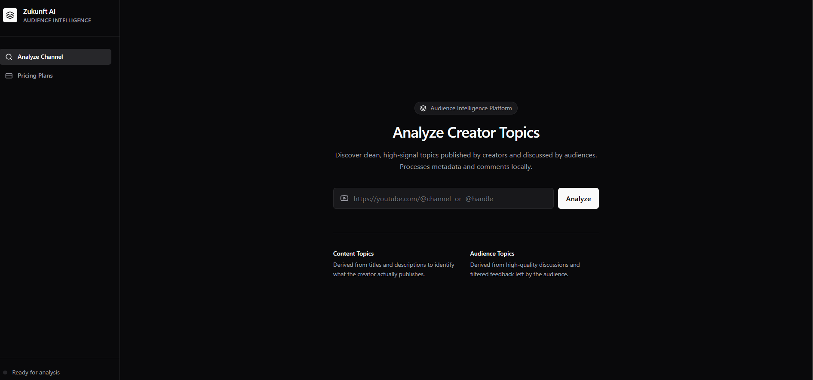

# Zukunft AI

Zukunft AI is a professional Audience Intelligence and Content Strategy Platform. It utilizes local natural language processing (BERT-based sentence transformers) to analyze YouTube channels, map creator uploads to actual viewer comment themes, validate content recommendations against public interest data, and deliver strategic growth opportunities.



## Core Features

- **Audience Theme Discovery**: Extract key discussion topics, feature requests, and feedback patterns directly from viewer comment threads.
- **Content Coverage Mapping**: Group published videos by semantic themes to understand actual content focus.
- **Strategic Recommendations**: Calculate a multi-factor Opportunity Score (combining Audience Signal, Content Alignment, Evidence Strength, and Trend Growth) to recommend actionable next videos.
- **Google Trends Validation**: Fetch and visualize real-time or fallback Google Trends data to cross-verify topic momentum.
- **Local Semantic Processing**: Run BERT embeddings directly in the browser via Hugging Face Transformers.

## Technology Stack

- **Frontend**: React, Vite, TypeScript, Tailwind CSS, Lucide React, Recharts
- **NLP / ML**: `@huggingface/transformers` (running `Xenova/all-MiniLM-L6-v2` locally)
- **Validation Backend**: Python, FastAPI, PyTrends (Google Trends API wrapper), Uvicorn

## Installation & Setup

### 1. Prerequisites
- **Node.js** (v18+)
- **Python** (v3.9+)
- **YouTube Data API v3 Key** (from Google Cloud Console)

### 2. Frontend Setup
1. Clone the repository and install dependencies:
   ```bash
   npm install
   ```
2. Create a `.env` file in the root directory and add your API credentials:
   ```env
   VITE_YOUTUBE_API_KEY=YOUR_YOUTUBE_API_KEY
   VITE_GROQ_API_KEY=YOUR_GROQ_API_KEY  # Optional: For advanced LLM recommendations
   ```
   *Note: If no Groq key is provided, the platform gracefully falls back to local semantic heuristics for recommendations.*
3. Start the Vite development server:
   ```bash
   npm run dev
   ```

### 3. Trends Backend Setup (Optional)
To enable external Google Trends validation:
1. Install Python packages:
   ```bash
   pip install fastapi uvicorn pytrends
   ```
2. Start the Uvicorn server:
   ```bash
   python trends_server.py
   ```
   *Note: The backend will run on `http://127.0.0.1:8000`. If unavailable, the frontend gracefully falls back to local simulation.*